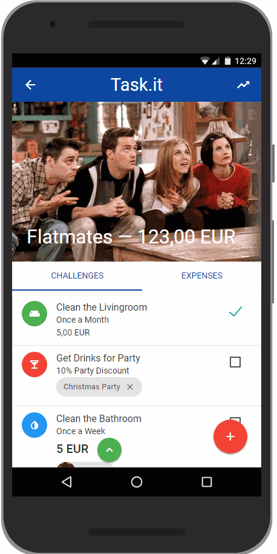

# Task.it!

## Inspiration

You know [Bankify](https://www.bankify.io/)? Shared group expenses? Good for you.

It should be more exiting. More convenient. Both at the same time!

## What it does

Taking Bankify to the next level.

1. Challenge your friends, create tasks and bid!

2. Do all the tasks, get discounts on shared expenses and become flat mate of the month!

3. Show around the statistics!

4. Automatically retrieve account history via **Nordea API** and add them to shared expenses. No manual typing.

## How we built it

A nice Python backend to retrieve live account data from Nordea.

The frontend is pure JavaScript <3

## Challenges we ran into

Making Banking fun again.

## Accomplishments that we're proud of

Making Banking fun again.

## What we learned

Lots about Banking APIs and group spending habits.

## What's next for Task.it

Integrate these nice new features into Bankify.
